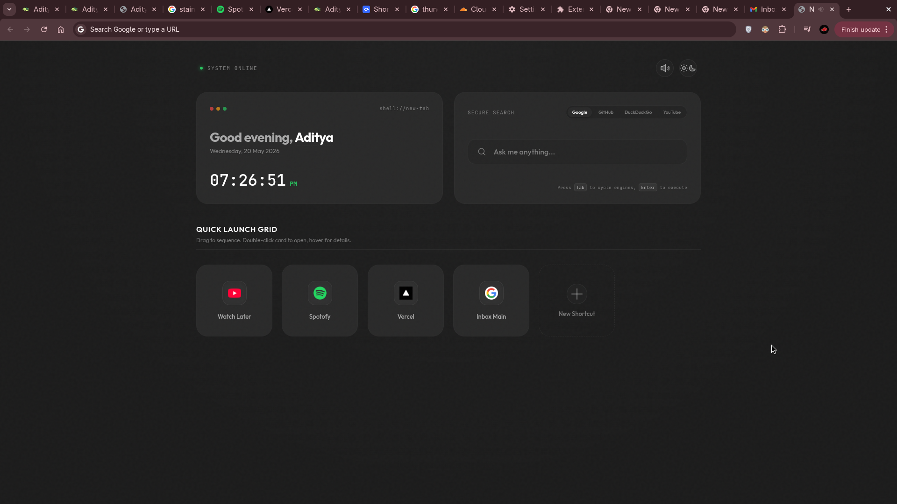

# Mosaic — New Tab Page

> A premium, minimal Chrome/Edge new tab page with a dark-glass bento grid aesthetic.  
> Add unlimited shortcuts, drag to reorder, auto-loads favicons, full dark & light theme.

[](https://github.com/adi-uchiha/mosaic/releases/latest)
[](LICENSE)
[](https://microsoftedge.microsoft.com/addons/detail/mosaic/YOUR-ID-HERE)



---

## ⚡ Install

### Option A — From Edge Add-ons Store (Recommended, free)
> Coming soon — link will be added on approval.

### Option B — Direct from GitHub (Chrome & Edge)

1. [**Download the latest ZIP**](https://github.com/adi-uchiha/mosaic/releases/latest/download/mosaic.zip)
2. Unzip it
3. Open Chrome → `chrome://extensions/` or Edge → `edge://extensions/`
4. Enable **Developer mode** (top-right toggle)
5. Click **"Load unpacked"** → select the `mosaic/` folder
6. Open a new tab ✅

---

## Features

| Feature | Detail |
|---|---|
| **Unlimited shortcuts** | Add as many site shortcuts as you want |
| **Auto favicon** | Icons load automatically via Google S2 favicon API with a letter-badge fallback |
| **Drag & drop order** | Drag any shortcut card to resequence — saved instantly |
| **Edit & delete** | Hover a card to reveal ✏️ edit and 🗑 delete action buttons |
| **Dark & Light theme** | Toggle with ☀️/🌙 — View Transition API cross-fade |
| **Multi-engine search** | Google · GitHub · DuckDuckGo · YouTube — `Tab` cycles |
| **Live clock** | Real-time HH:MM:SS with context-aware greeting |
| **Editable name** | Click the greeting name to personalise it |
| **Web Audio tones** | Synth sounds on actions (toggle with 🔊) |
| **Keyboard navigation** | Full keyboard accessibility throughout |
| **Persistent** | Everything saved in `localStorage` — no account needed |
| **Zero dependencies** | Pure HTML + CSS + JS — loads in < 5ms |

---

## Keyboard Shortcuts

| Key | Action |
|---|---|
| `/` | Focus the search bar |
| `Tab` | Next shortcut card |
| `Shift + Tab` | Previous shortcut card |
| `Enter` / `Space` | Open focused shortcut |
| `E` | Edit focused shortcut |
| `Delete` / `Backspace` | Delete focused shortcut |
| `Tab` (in search) | Cycle search engine |
| `Enter` (in search) | Execute search |
| `Escape` | Close modal |

---

## Project Structure

```
mosaic/
├── index.html               — Page structure, widgets, modal
├── styles.css               — Full design system, dark/light themes
├── app.js                   — All logic: shortcuts, drag-drop, theme, clock, search
├── manifest.json            — Chrome/Edge Extension Manifest v3
├── icons/
│   ├── icon.svg             — Source icon (edit this to change the design)
│   ├── icon-16.png          — Toolbar icon
│   ├── icon-32.png          — Windows taskbar icon
│   ├── icon-48.png          — Extensions management page icon
│   └── icon-128.png         — Store + install dialog icon
├── store-listing/
│   └── ready/               — 1280×800 screenshots ready for store upload
├── CHANGELOG.md             — Version history
├── PUBLISHING.md            — Chrome Web Store publishing guide
├── EDGE_PUBLISHING.md       — Edge Add-ons publishing guide
└── GITHUB_RELEASES.md       — GitHub Releases setup guide
```

---

## Contributing

1. Fork the repo
2. Create a feature branch: `git checkout -b feat/my-feature`
3. Commit: `git commit -m 'feat: add my feature'`
4. Push and open a Pull Request

---

## Privacy

Mosaic collects **zero data**. All state (shortcuts, theme, name) is stored locally in your browser's `localStorage`. Nothing is sent to any server.

---

## License

MIT © Aditya Shelke
